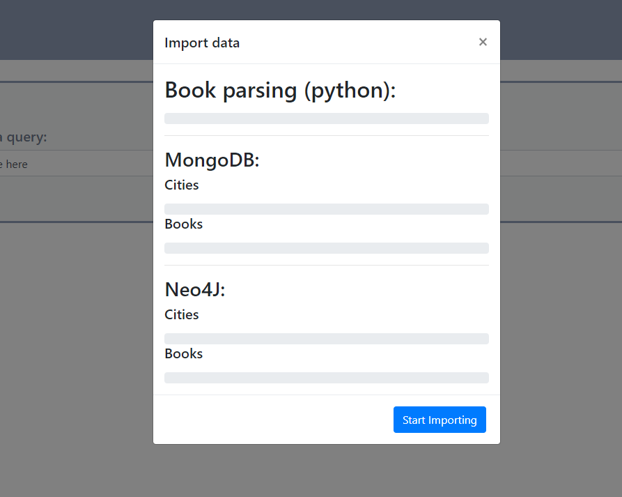

<h5 align="right">30.05.2019</h5>
<hr><h1 align="center">:books: GUTENBERG PROJECT :books:</h1>
<h3 align="right">Semester Project of <em>"Databases for Developers"</em> course</h3> 
</br>

The final result of this project is an application which operates with a Document-oriented  and a Graph  database. As a complement, a front-end  has been made to ease the process of interchanging  the database paradigm in use, while quering  the data. 

The end user is provided with 4 different ways of querying the records in the persisted storages. Each query has been executed 20 times (per database) and the times taken  for their executions were recorded respectively. This enabled us to draw conclusions :bar_chart::chart_with_upwards_trend: from the timings we got, in regards of several different aspects for both databases.

</br>

---
<a name="toc"></a>
## Table of Contents  
* [Application](#app)
* [Queries](#query)
* [Timings](#time)
* [Conclusion](#end)

</br>

---
<a name="app"></a>
## Application 
### Specifics
- Docker :whale:
- MongoDB  
- Neo4j 
- Python 
- Flask 
- RDF 
- Folium 

</br>

### Getting started
**Minimum requirements:**</br>
> Docker

> Python3
 - `pip install rdflib`
 - `pip install geotext`
 - `pip install flask`
 - `pip install folium`
 - `pip install neo4j`
 - `pip install pymongo`
 
 </br>
 
To be able to successfully run the application all the above requirements need to be met! This guide will rely heavily on the usage of Docker to be able to run the database systems.

To start off, you will first clone the repository by using the command `git clone https://github.com/elit0451/GutenbergPoject.git`. When this process is finished, we need to create a couple of new folders. 
</br>The new folders to create are:
```
GutenbergProject > Databases
GutenbergProject > Databases > mongo_data
GutenbergProject > Databases > neo4j_data
GutenbergProject > Resources > Books
GutenbergProject > Resources > Offline_Catalogue
```

Creating these folders will ensure the proper usage of the following docker commands.
</br></br>

When all the folders are properly created we can begin to populate them, starting by getting all the textbook files _(.txt)_ into the **“Resources > Books”** folder. Bear in mind that our application only accepts numerical .txt files _(ex. 1.txt, 2.txt, etc)_, since the **Offline_Catalogue** book where we get our _Titles_ and _Authors_ from also does not contain alphanumerical names.
The next step is to insert the folders, found by downloading the offline catalogue zip file, into **“Resources > Offline_Catalogue”**, in a way that the path to a .rdf file would be _ex. “Resources > Offline_Catalogue > 0 > pg0.rdf”_.

Please verify if your folder structure resembles the following image:

<p align="center">

</p>

</br>

If it does, now we are ready to proceed to the next step. Navigate to the folder **“Databases”** within your shell and start both database containers by executing the following commands:
> Neo4J : 

```docker run -d --rm --name neo4j --publish=7474:7474 --publish=7687:7687 -v ${PWD}/../Resources:/var/lib/neo4j/import -v ${PWD}/neo4j_data:/data --env NEO4J_AUTH=neo4j/secur3P4ss --env NEO4J_dbms_memory_heap_max__size=4G neo4j```  
NB:exclamation: For _Windows_ users you would need to make the extra step of creating a volume using `docker volume create --name=neo4j_data` before spinning the container.

> MongoDB :

```docker run --rm -v ${PWD}/mongo_data:/data/db --publish=27017:27017 --name mongodb -d mongo:latest```  
NB:exclamation: For _Windows_ users you would need to make the extra step of creating a volume using `docker volume create --name=mongo_data` before spinning the container.

</br>

After this is done the last step is to go into the application folder and execute the _“webapp.py”_ file with the command `python webapp.py` or `python3 webapp.py` depending on your installation.

</br>

With all the work out of the way you can now easily navigate to [http://localhost:3333](http://localhost:3333) and be presented with the import screen of our application. If all the steps before went well you just need to press **“Start Importing”** as seen below:

<p align="center">

</p>

</br>

Let the program sit for a bit while you go and enjoy a nice cup of coffee... :coffee: Depending on your hardware this might take up to an hour.
When done you can hit the **“Finish”** button and proceed to choose queries to execute, as well as the database which should perform the search.

</br>


</br>

---
<a name="query"></a>
## Queries 
### Data modeling


For **MongoDB**, we opted to implement a two-collection model. This way plenty of redundancy was avoided which leads to smaller size occupied in disk, as well as more perceptible relations between data.
For the _Books Collection_, it was decided that the best approach to keep track of cities mentioned in a book was to insert them as a string[], part of each document.
Two indexes were created on the _Geodata Collection_ which allowed for fast lookup on a given city’s coordinates, as well as to enable the location to be used in spatial queries.

</br>


For **Neo4j**, the team focused on keeping the two domains separated, leading to two node labels being created, _Book_ and _City_. Since relationships are part of the essential Neo4j nature, we took advantage of it to keep track of all the cities mentioned by a book.
Due to the dataset containing multiple entries per city name, a _Constraint_ was created on this field to avoid several city records with the same name.  

</br>

### Data importing
> MongoDB

The strategy for populating data into the Mongo database was to try to store as many objects as we could in memory before passing it onto MongoDB with the `insertMany()` command. This allowed us to have faster insertion times compared to inserting records one by one. One thing to have into consideration when inserting into the _Geodata Collection_, was the fact that coordinates should be inserted into a GeoJSON format.

</br>

> Neo4j

When dealing with Neo4j we had a different approach towards importing the books and the cities data, given that they are obtained from completely different sources. The books come from the already parsed `booksData` data, therefore, the most reasonable approach is to insert their records by using simple cypher expressions, executed in the Neo4j database. Although, a very simple and straight-forward solution, it comes with a performance cost, which is why the team looked into transactions to make this a more streamlined process. As far as the cities go, the `LOAD CSV` cypher query was preferred as it has better performance and allows us to be precise with which data gets persisted into the database. You can have a more in-depth view of the previous paragraphs if you visit [neo4jImporter.py](./Application/neo4jImporter.py) and [mongoImporter.py](./Application/mongoImporter.py)

</br>

<details><summary>Show database queries</summary>
</br>

> 1. Given a city name, return all book titles with corresponding authors that mention this city.

> <b>MongoDB</b>
```javascript
db.books.aggregate(
  {
    "$match":{"cities": "London"}
  },
  {
    "$project":
    {
      "title": 1,
      "author": 1,
      "_id": 0
    }
  })
```
> <b>Neo4j</b>
```javascript
MATCH (book:Book)-[:MENTIONS]-(city:City {name: "London"})
RETURN book.title, book.author
```

</br>

> 2. Given a book title, plot all cities mentioned in this book onto a map.

> <b>MongoDB</b>
```javascript
db.books.aggregate(
  {
      "$match":{"title": "The Voice"}
  },
  {
      "$unwind": "$cities"
  },
  {
      "$lookup":
      {
          "from": "geodata",
          "localField": "cities",
          "foreignField": "city",
          "as": "cityCoordinates"
      }
  },
  {
      "$project":
      {
          "cities": 1,
          "location": { "$arrayElemAt": ["$cityCoordinates.location", 0] },
          "_id": 0
      }
  })
```
> <b>Neo4j</b>
```javascript
MATCH (:Book {title:"The Voice"})-[:MENTIONS]-(city:City)
RETURN city.name, city.long,city.latt
```

</br>

> 3. Given an author name, list all books written by that author and plot all cities mentioned in any of the books onto a map.

> <b>MongoDB</b>
```javascript
db.books.aggregate(
  {
      "$match":{"author": "Bret Harte"}
  },
  {
      "$project":
      {
          "title": 1,
          "cities": 1,
          "_id": 0
      }
  })
```
> <b>Neo4j</b>
```javascript
MATCH (book:Book {author:"Bret Harte"})-[:MENTIONS]-(city:City)
RETURN book.title, collect(city)
```

</br>

> 4. Given a geolocation, list all books mentioning a city in vicinity of the given geolocation.

> <b>MongoDB</b>
```javascript
db.geodata.aggregate(
  {         
      "$geoNear": 
      {
          "distanceField": "location",
          "near":
          {
              "type": 'Point',
              "coordinates": [ 10.65771, 59.43403 ]
          },
          "maxDistance": 50000,
          "spherical": "true",
          "limit": 1000
      }
  },
  {
      "$project":
      {
          "city": 1,
          "_id": 0
      }
  })
```
> <b>Neo4j</b>
```javascript
MATCH (city:City)
WITH point({ x: city.long, y: city.latt, crs: 'WGS-84' }) AS p1, point({ x: 10.65771 , y: 59.43403, crs: 'WGS-84' }) AS p2, city
WHERE distance(p1,p2) < 50000
WITH city
MATCH (book:Book)-[:MENTIONS]-(c:City)
WHERE id(c) = id(city)
RETURN c.name, collect(book.title)
```

</br>

<p align="right">
<a href="#toc"></a></p>
</details>

---
<a name="time"></a>
## Timings 
<details><summary>Show timing results</summary>
</br>
  
Within this table you can find all the single execution results (in seconds) that were gathered to calculate the _averages_ in the next section.

<table>
    <tr>
        <th>
          Database
        </th>
        <th>
            Query 1
        </th>
        <th>
            Query 2
        </th>
        <th>
            Query 3
        </th>
        <th>
            Query 4
        </th>
    </tr>
    <tr>
        <td>
            <table align="center">
                <tr>
                    <td>MongoDB</td>
                </tr>
                <tr>
                    <td>Neo4j</td>
                </tr>
            </table>
        </td>
        <td>
            <table align="center">
                <tr>
                    <td align="center">1.79532</td>
                </tr>
                <tr>
                    <td align="center">0.08815</td>
                </tr>
            </table>
        </td>
        <td>
            <table align="center">
                <tr>
                    <td align="center">1.29885</td>
                </tr>
                <tr>
                    <td align="center">0.08719</td>
                </tr>
            </table>
        </td>
        <td>
            <table align="center">
                <tr>
                    <td align="center">35.9603</td>
                </tr>
                <tr>
                    <td align="center">0.14842</td>
                </tr>
            </table>
        </td>
        <td>
            <table align="center">
                <tr>
                    <td align="center">0.40464</td>
                </tr>
                <tr>
                    <td align="center">0.24779</td>
                </tr>
            </table>
        </td>
    </tr>
    <tr>
        <td>
            <table align="center">
                <tr>
                    <td>MongoDB</td>
                </tr>
                <tr>
                    <td>Neo4j</td>
                </tr>
            </table>
        </td>
        <td>
            <table align="center">
                <tr>
                    <td align="center">0.2553</td>
                </tr>
                <tr>
                    <td align="center">0.30956</td>
                </tr>
            </table>
        </td>
        <td>
            <table align="center">
                <tr>
                    <td align="center">1.56245</td>
                </tr>
                <tr>
                    <td align="center">0.05984</td>
                </tr>
            </table>
        </td>
        <td>
            <table align="center">
                <tr>
                    <td align="center">6.41759</td>
                </tr>
                <tr>
                    <td align="center">0.1641</td>
                </tr>
            </table>
        </td>
        <td>
            <table align="center">
                <tr>
                    <td align="center">0.67233</td>
                </tr>
                <tr>
                    <td align="center">0.26089</td>
                </tr>
            </table>
        </td>
    </tr>
    <tr>
        <td>
            <table align="center">
                <tr>
                    <td>MongoDB</td>
                </tr>
                <tr>
                    <td>Neo4j</td>
                </tr>
            </table>
        </td>
        <td>
            <table align="center">
                <tr>
                    <td align="center">0.38265</td>
                </tr>
                <tr>
                    <td align="center">0.83574</td>
                </tr>
            </table>
        </td>
        <td>
            <table align="center">
                <tr>
                    <td align="center">0.16364</td>
                </tr>
                <tr>
                    <td align="center">0.06369</td>
                </tr>
            </table>
        </td>
        <td>
            <table align="center">
                <tr>
                    <td align="center">14.5348</td>
                </tr>
                <tr>
                    <td align="center">0.28673</td>
                </tr>
            </table>
        </td>
        <td>
            <table align="center">
                <tr>
                    <td align="center">47.2525</td>
                </tr>
                <tr>
                    <td align="center">0.29897</td>
                </tr>
            </table>
        </td>
    </tr>
    <tr>
        <td>
            <table align="center">
                <tr>
                    <td>MongoDB</td>
                </tr>
                <tr>
                    <td>Neo4j</td>
                </tr>
            </table>
        </td>
        <td>
            <table align="center">
                <tr>
                    <td align="center">0.13137</td>
                </tr>
                <tr>
                    <td align="center">0.13029</td>
                </tr>
            </table>
        </td>
        <td>
            <table align="center">
                <tr>
                    <td align="center">0.6559</td>
                </tr>
                <tr>
                    <td align="center">0.08972</td>
                </tr>
            </table>
        </td>
        <td>
            <table align="center">
                <tr>
                    <td align="center">31.6152</td>
                </tr>
                <tr>
                    <td align="center">0.11922</td>
                </tr>
            </table>
        </td>
        <td>
            <table align="center">
                <tr>
                    <td align="center">0.0623</td>
                </tr>
                <tr>
                    <td align="center">0.33614</td>
                </tr>
            </table>
        </td>
    </tr>
    <tr>
        <td>
            <table align="center">
                <tr>
                    <td>MongoDB</td>
                </tr>
                <tr>
                    <td>Neo4j</td>
                </tr>
            </table>
        </td>
        <td>
            <table align="center">
                <tr>
                    <td align="center">0.06381</td>
                </tr>
                <tr>
                    <td align="center">0.8154</td>
                </tr>
            </table>
        </td>
        <td>
            <table align="center">
                <tr>
                    <td align="center">0.67314</td>
                </tr>
                <tr>
                    <td align="center">0.121</td>
                </tr>
            </table>
        </td>
        <td>
            <table align="center">
                <tr>
                    <td align="center">35.9261</td>
                </tr>
                <tr>
                    <td align="center">0.20234</td>
                </tr>
            </table>
        </td>
        <td>
            <table align="center">
                <tr>
                    <td align="center">0.05531</td>
                </tr>
                <tr>
                    <td align="center">0.35854</td>
                </tr>
            </table>
        </td>
    </tr>
    <tr>
        <td>
            <table align="center">
                <tr>
                    <td>MongoDB</td>
                </tr>
                <tr>
                    <td>Neo4j</td>
                </tr>
            </table>
        </td>
        <td>
            <table align="center">
                <tr>
                    <td align="center">0.13093</td>
                </tr>
                <tr>
                    <td align="center">0.09671</td>
                </tr>
            </table>
        </td>
        <td>
            <table align="center">
                <tr>
                    <td align="center">0.72138</td>
                </tr>
                <tr>
                    <td align="center">0.07021</td>
                </tr>
            </table>
        </td>
        <td>
            <table align="center">
                <tr>
                    <td align="center">13.4992</td>
                </tr>
                <tr>
                    <td align="center">0.10556</td>
                </tr>
            </table>
        </td>
        <td>
            <table align="center">
                <tr>
                    <td align="center">4.01957</td>
                </tr>
                <tr>
                    <td align="center">0.35354</td>
                </tr>
            </table>
        </td>
    </tr>
    <tr>
        <td>
            <table align="center">
                <tr>
                    <td>MongoDB</td>
                </tr>
                <tr>
                    <td>Neo4j</td>
                </tr>
            </table>
        </td>
        <td>
            <table align="center">
                <tr>
                    <td align="center">0.1244</td>
                </tr>
                <tr>
                    <td align="center">0.04422</td>
                </tr>
            </table>
        </td>
        <td>
            <table align="center">
                <tr>
                    <td align="center">0.26973</td>
                </tr>
                <tr>
                    <td align="center">0.07152</td>
                </tr>
            </table>
        </td>
        <td>
            <table align="center">
                <tr>
                    <td align="center">0.76529</td>
                </tr>
                <tr>
                    <td align="center">0.12107</td>
                </tr>
            </table>
        </td>
        <td>
            <table align="center">
                <tr>
                    <td align="center">0.15076</td>
                </tr>
                <tr>
                    <td align="center">0.17116</td>
                </tr>
            </table>
        </td>
    </tr>
    <tr>
        <td>
            <table align="center">
                <tr>
                    <td>MongoDB</td>
                </tr>
                <tr>
                    <td>Neo4j</td>
                </tr>
            </table>
        </td>
        <td>
            <table align="center">
                <tr>
                    <td align="center">0.13515</td>
                </tr>
                <tr>
                    <td align="center">0.03274</td>
                </tr>
            </table>
        </td>
        <td>
            <table align="center">
                <tr>
                    <td align="center">0.9563</td>
                </tr>
                <tr>
                    <td align="center">0.06938</td>
                </tr>
            </table>
        </td>
        <td>
            <table align="center">
                <tr>
                    <td align="center">0.71699</td>
                </tr>
                <tr>
                    <td align="center">0.07459</td>
                </tr>
            </table>
        </td>
        <td>
            <table align="center">
                <tr>
                    <td align="center">1.10767</td>
                </tr>
                <tr>
                    <td align="center">0.17143</td>
                </tr>
            </table>
        </td>
    </tr>
    <tr>
        <td>
            <table align="center">
                <tr>
                    <td>MongoDB</td>
                </tr>
                <tr>
                    <td>Neo4j</td>
                </tr>
            </table>
        </td>
        <td>
            <table align="center">
                <tr>
                    <td align="center">0.12132</td>
                </tr>
                <tr>
                    <td align="center">0.08094</td>
                </tr>
            </table>
        </td>
        <td>
            <table align="center">
                <tr>
                    <td align="center">0.60809</td>
                </tr>
                <tr>
                    <td align="center">0.08499</td>
                </tr>
            </table>
        </td>
        <td>
            <table align="center">
                <tr>
                    <td align="center">8.02293</td>
                </tr>
                <tr>
                    <td align="center">0.35651</td>
                </tr>
            </table>
        </td>
        <td>
            <table align="center">
                <tr>
                    <td align="center">14.2717</td>
                </tr>
                <tr>
                    <td align="center">0.29681</td>
                </tr>
            </table>
        </td>
    </tr>
    <tr>
        <td>
            <table align="center">
                <tr>
                    <td>MongoDB</td>
                </tr>
                <tr>
                    <td>Neo4j</td>
                </tr>
            </table>
        </td>
        <td>
            <table align="center">
                <tr>
                    <td align="center">0.12561</td>
                </tr>
                <tr>
                    <td align="center">0.06315</td>
                </tr>
            </table>
        </td>
        <td>
            <table align="center">
                <tr>
                    <td align="center">1.17752</td>
                </tr>
                <tr>
                    <td align="center">0.07034</td>
                </tr>
            </table>
        </td>
        <td>
            <table align="center">
                <tr>
                    <td align="center">4.06152</td>
                </tr>
                <tr>
                    <td align="center">0.65185</td>
                </tr>
            </table>
        </td>
        <td>
            <table align="center">
                <tr>
                    <td align="center">7.11391</td>
                </tr>
                <tr>
                    <td align="center">0.2281</td>
                </tr>
            </table>
        </td>
    </tr>
    <tr>
        <td>
            <table align="center">
                <tr>
                    <td>MongoDB</td>
                </tr>
                <tr>
                    <td>Neo4j</td>
                </tr>
            </table>
        </td>
        <td>
            <table align="center">
                <tr>
                    <td align="center">0.11008</td>
                </tr>
                <tr>
                    <td align="center">0.06619</td>
                </tr>
            </table>
        </td>
        <td>
            <table align="center">
                <tr>
                    <td align="center">0.69653</td>
                </tr>
                <tr>
                    <td align="center">0.07008</td>
                </tr>
            </table>
        </td>
        <td>
            <table align="center">
                <tr>
                    <td align="center">0.45081</td>
                </tr>
                <tr>
                    <td align="center">0.31975</td>
                </tr>
            </table>
        </td>
        <td>
            <table align="center">
                <tr>
                    <td align="center">1.45438</td>
                </tr>
                <tr>
                    <td align="center">0.20642</td>
                </tr>
            </table>
        </td>
    </tr>
    <tr>
        <td>
            <table align="center">
                <tr>
                    <td>MongoDB</td>
                </tr>
                <tr>
                    <td>Neo4j</td>
                </tr>
            </table>
        </td>
        <td>
            <table align="center">
                <tr>
                    <td align="center">0.13451</td>
                </tr>
                <tr>
                    <td align="center">0.03409</td>
                </tr>
            </table>
        </td>
        <td>
            <table align="center">
                <tr>
                    <td align="center">0.53999</td>
                </tr>
                <tr>
                    <td align="center">0.11354</td>
                </tr>
            </table>
        </td>
        <td>
            <table align="center">
                <tr>
                    <td align="center">6.84271</td>
                </tr>
                <tr>
                    <td align="center">0.17759</td>
                </tr>
            </table>
        </td>
        <td>
            <table align="center">
                <tr>
                    <td align="center">0.14187</td>
                </tr>
                <tr>
                    <td align="center">0.17873</td>
                </tr>
            </table>
        </td>
    </tr>
    <tr>
        <td>
            <table align="center">
                <tr>
                    <td>MongoDB</td>
                </tr>
                <tr>
                    <td>Neo4j</td>
                </tr>
            </table>
        </td>
        <td>
            <table align="center">
                <tr>
                    <td align="center">0.13255</td>
                </tr>
                <tr>
                    <td align="center">0.03411</td>
                </tr>
            </table>
        </td>
        <td>
            <table align="center">
                <tr>
                    <td align="center">0.40102</td>
                </tr>
                <tr>
                    <td align="center">0.09611</td>
                </tr>
            </table>
        </td>
        <td>
            <table align="center">
                <tr>
                    <td align="center">1.72922</td>
                </tr>
                <tr>
                    <td align="center">0.19251</td>
                </tr>
            </table>
        </td>
        <td>
            <table align="center">
                <tr>
                    <td align="center">0.12909</td>
                </tr>
                <tr>
                    <td align="center">0.17939</td>
                </tr>
            </table>
        </td>
    </tr>
    <tr>
        <td>
            <table align="center">
                <tr>
                    <td>MongoDB</td>
                </tr>
                <tr>
                    <td>Neo4j</td>
                </tr>
            </table>
        </td>
        <td>
            <table align="center">
                <tr>
                    <td align="center">0.15083</td>
                </tr>
                <tr>
                    <td align="center">0.03755</td>
                </tr>
            </table>
        </td>
        <td>
            <table align="center">
                <tr>
                    <td align="center">0.53425</td>
                </tr>
                <tr>
                    <td align="center">0.08473</td>
                </tr>
            </table>
        </td>
        <td>
            <table align="center">
                <tr>
                    <td align="center">0.95538</td>
                </tr>
                <tr>
                    <td align="center">0.16311</td>
                </tr>
            </table>
        </td>
        <td>
            <table align="center">
                <tr>
                    <td align="center">0.66689</td>
                </tr>
                <tr>
                    <td align="center">0.17681</td>
                </tr>
            </table>
        </td>
    </tr>
    <tr>
        <td>
            <table align="center">
                <tr>
                    <td>MongoDB</td>
                </tr>
                <tr>
                    <td>Neo4j</td>
                </tr>
            </table>
        </td>
        <td>
            <table align="center">
                <tr>
                    <td align="center">0.17828</td>
                </tr>
                <tr>
                    <td align="center">0.03852</td>
                </tr>
            </table>
        </td>
        <td>
            <table align="center">
                <tr>
                    <td align="center">1.47397</td>
                </tr>
                <tr>
                    <td align="center">0.06681</td>
                </tr>
            </table>
        </td>
        <td>
            <table align="center">
                <tr>
                    <td align="center">27.5729</td>
                </tr>
                <tr>
                    <td align="center">0.39234</td>
                </tr>
            </table>
        </td>
        <td>
            <table align="center">
                <tr>
                    <td align="center">17.5287</td>
                </tr>
                <tr>
                    <td align="center">0.28654</td>
                </tr>
            </table>
        </td>
    </tr>
    <tr>
        <td>
            <table align="center">
                <tr>
                    <td>MongoDB</td>
                </tr>
                <tr>
                    <td>Neo4j</td>
                </tr>
            </table>
        </td>
        <td>
            <table align="center">
                <tr>
                    <td align="center">0.13061</td>
                </tr>
                <tr>
                    <td align="center">0.03966</td>
                </tr>
            </table>
        </td>
        <td>
            <table align="center">
                <tr>
                    <td align="center">0.02841</td>
                </tr>
                <tr>
                    <td align="center">0.0715</td>
                </tr>
            </table>
        </td>
        <td>
            <table align="center">
                <tr>
                    <td align="center">86.685</td>
                </tr>
                <tr>
                    <td align="center">0.48783</td>
                </tr>
            </table>
        </td>
        <td>
            <table align="center">
                <tr>
                    <td align="center">21.7945</td>
                </tr>
                <tr>
                    <td align="center">0.21548</td>
                </tr>
            </table>
        </td>
    </tr>
    <tr>
        <td>
            <table align="center">
                <tr>
                    <td>MongoDB</td>
                </tr>
                <tr>
                    <td>Neo4j</td>
                </tr>
            </table>
        </td>
        <td>
            <table align="center">
                <tr>
                    <td align="center">0.11889</td>
                </tr>
                <tr>
                    <td align="center">0.09476</td>
                </tr>
            </table>
        </td>
        <td>
            <table align="center">
                <tr>
                    <td align="center">0.50327</td>
                </tr>
                <tr>
                    <td align="center">0.06981</td>
                </tr>
            </table>
        </td>
        <td>
            <table align="center">
                <tr>
                    <td align="center">10.7559</td>
                </tr>
                <tr>
                    <td align="center">0.28504</td>
                </tr>
            </table>
        </td>
        <td>
            <table align="center">
                <tr>
                    <td align="center">0.64854</td>
                </tr>
                <tr>
                    <td align="center">0.16373</td>
                </tr>
            </table>
        </td>
    </tr>
    <tr>
        <td>
            <table align="center">
                <tr>
                    <td>MongoDB</td>
                </tr>
                <tr>
                    <td>Neo4j</td>
                </tr>
            </table>
        </td>
        <td>
            <table align="center">
                <tr>
                    <td align="center">0.12447</td>
                </tr>
                <tr>
                    <td align="center">0.04761</td>
                </tr>
            </table>
        </td>
        <td>
            <table align="center">
                <tr>
                    <td align="center">0.36443</td>
                </tr>
                <tr>
                    <td align="center">0.07655</td>
                </tr>
            </table>
        </td>
        <td>
            <table align="center">
                <tr>
                    <td align="center">3.65705</td>
                </tr>
                <tr>
                    <td align="center">0.14198</td>
                </tr>
            </table>
        </td>
        <td>
            <table align="center">
                <tr>
                    <td align="center">0.13902</td>
                </tr>
                <tr>
                    <td align="center">0.20957</td>
                </tr>
            </table>
        </td>
    </tr>
    <tr>
        <td>
            <table align="center">
                <tr>
                    <td>MongoDB</td>
                </tr>
                <tr>
                    <td>Neo4j</td>
                </tr>
            </table>
        </td>
        <td>
            <table align="center">
                <tr>
                    <td align="center">0.12839</td>
                </tr>
                <tr>
                    <td align="center">0.03529</td>
                </tr>
            </table>
        </td>
        <td>
            <table align="center">
                <tr>
                    <td align="center">0.23116</td>
                </tr>
                <tr>
                    <td align="center">0.0738</td>
                </tr>
            </table>
        </td>
        <td>
            <table align="center">
                <tr>
                    <td align="center">1.83735</td>
                </tr>
                <tr>
                    <td align="center">0.35952</td>
                </tr>
            </table>
        </td>
        <td>
            <table align="center">
                <tr>
                    <td align="center">0.12765</td>
                </tr>
                <tr>
                    <td align="center">0.1991</td>
                </tr>
            </table>
        </td>
    </tr>
    <tr>
        <td>
            <table align="center">
                <tr>
                    <td>MongoDB</td>
                </tr>
                <tr>
                    <td>Neo4j</td>
                </tr>
            </table>
        </td>
        <td>
            <table align="center">
                <tr>
                    <td align="center">0.14313</td>
                </tr>
                <tr>
                    <td align="center">0.03195</td>
                </tr>
            </table>
        </td>
        <td>
            <table align="center">
                <tr>
                    <td align="center">0.75282</td>
                </tr>
                <tr>
                    <td align="center">0.06504</td>
                </tr>
            </table>
        </td>
        <td>
            <table align="center">
                <tr>
                    <td align="center">33.9647</td>
                </tr>
                <tr>
                    <td align="center">0.26542</td>
                </tr>
            </table>
        </td>
        <td>
            <table align="center">
                <tr>
                    <td align="center">0.54426</td>
                </tr>
                <tr>
                    <td align="center">0.23108</td>
                </tr>
            </table>
        </td>
    </tr>
</table>

<p align="right">
<a href="#toc"></a></p>

</details>
</br>

> Average results

|   |MongoDB|Neo4j|
|:-:|:-:|:---:|
|**Query 1**|0.23088|0.1478315|
|**Query 2**|0.6806425|0.0787925|
|**Query 3**|16.298547|0.250774|
|**Query 4**|5.9142795|0.238511|

</br>
From the conducted analysis of the application’s performance, it can be seen that Neo4j outruns MongoDB in every single query. We need to take into account that these results are also due to our own modeling choices and different database models might have yield different results. The recorded times mentioned above are only considered from a query execution perspective and not at all front-end runtime. But even so, from a user perspective the Neo4j superiority could be felt as the queries return a render on the page procedurally.

</br>

---
<a name="end"></a>
## Conclusion
For this project, we have analyzed the advantages and disadvantages of each of the chosen databases (MongoDB and Neo4j). All the work done to model the data, build the application an posterior analysis have led the team to believe that in a production environment with a similar use case, Neo4j would be the most suitable solution. This had already been confirmed from previous assignments, the team had worked on, where once again Neo4j stood out for its fast response while querying for relationships between entities. Even though all the praise, in the current use case, Neo4j lacked in the importing scene, being much slower than its competitor, MongoDB.
</br>

The team would like to revisit this same scenario using MySql as we believe that the type of established relationships between entities can be pretty suitable for such an engine. Overall, we enjoyed working on this project and got to depthen our databases knowledge, as well as picking up on some useful Python skills.   

</br>

___
> #### Project made by:   
`David Alves 👨🏻‍💻 ` :octocat: [Github](https://github.com/davi7725) <br />
`Elitsa Marinovska 👩🏻‍💻 ` :octocat: [Github](https://github.com/elit0451) <br />
> Attending "Databases for Developers" course of Software Development bachelor's degree
